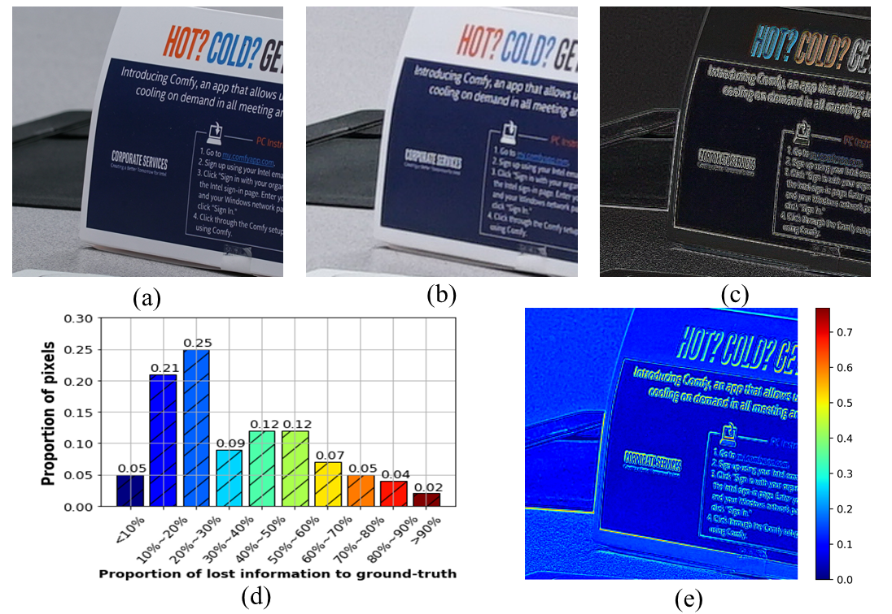
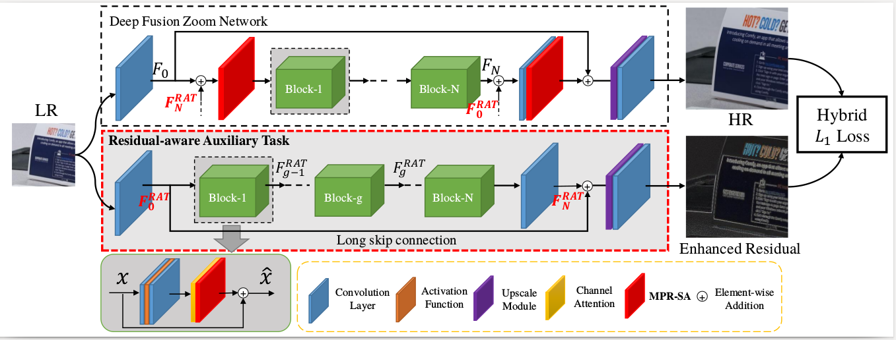
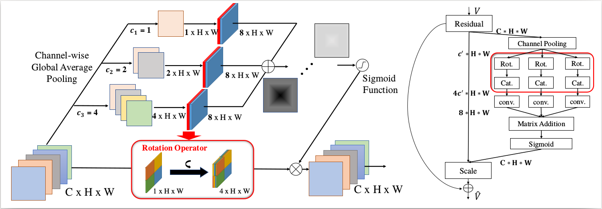
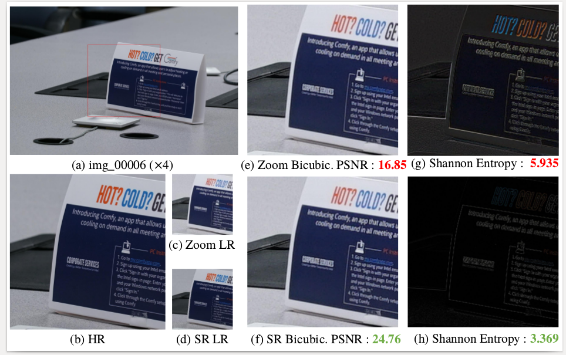

# SRNet for digital zoom

Code for paper: Self-supervised Residual-aware Network for Digital Zoom
This paper proposes SRNet for digital zoom which takes advantage of self-supervised learning (SSL) and multi-task learning (MTL)

This code is based on:

Python 3.7.3

Pytorch 1.1.0

Ubuntu16.04 LTS

## Data Processing

1). Download and Extract Dataset

Problems in origin Image:
1. train/00004 unable to align with the align code
2. train/00560 data 00006.RAW copy to  train/00561 Rename to 00001.RAW
3. train/00350 data destroy due to compress. Delete 00005.RAW, 00006.RAW, 00007.RAW files

then run the bash code
```
bash ./scripts/run_align.sh /store/dataset/zoom/train
bash ./scripts/run_wb.sh [TRAIN_PATH]
bash ./scripts/run_align.sh [TEST_PATH]
bash ./scripts/run_wb.sh [TEST_PATH]
```
After running these scripts, you can use the tform.txt and wb.txt inside each sequence during training.


2). Align Data and Crop Patch
```
## setting
## source data directory
dir_data="/store/dataset/zoom"
## destination data directory
data_dir = "/store2/dataset/SR/train_data/(SRRAW/X4/train)"
## scale: up_ratio
scale = 4 or 8


bash run => python split_and_save_data.py
python split_and_save_data.py --data_dir /store2/dataset/SR/train_data --source_dir /store2/dataset/SR/zoom --scale 8 --test
```


directory tree of data:
```
data_dir
├── ARW
├── HR
└── LR
```

3). Generate self-supervised labels,[Edge, Diff]
```
## setting
traindataRootDir = "/store2/dataset/SR/train_data/SRRAW/X4/train"
python generate_s_label.py
```
```
├── ARW
├── Diff
├── Edge
├── HR
└── LR
```
4). Test SRRAW Dataset to generate bin file for png
```
## setting options.py
parser.add_argument('--dir_data', type=str, default='/store2/dataset/SR/train_data',
                    help='dataset directory')
parser.add_argument('--data_train', type=str, default='SRRAW',
                    help='train dataset name')
parser.add_argument('--data_test', type=str, default='SRRAW',
                    help='test dataset name')
parser.add_argument('--data_range', type=str, default='1-1300/1301-1312',
                    help='train/test data range')

## bash run
python debug_dataset.py
```
```
.
├── ARW
├── bin
├── Diff
├── Edge
├── HR
└── LR
```
## Motivation



Above figure shows  challenge of digital zoom task and its missing information. A high-resolution image xi in Figure(a), its corresponding low-resolution one, which has been resized by bicubic interpolation in Figure(b) and residual image in Figure(c). We calculate the proportion of residual image in high resolution image pixel by pixel and plot the histogram for the number of pixels according to different proportions in Figure(d). Most of the pixels have a high missing information in zoom task. Heatmap of residual image is also shown in Figure(e) and the missing information is mainly concentrated on edges and textures.
## Network Architecture


## Attention Mechanism



## Training

## Test

## Compared with SR

